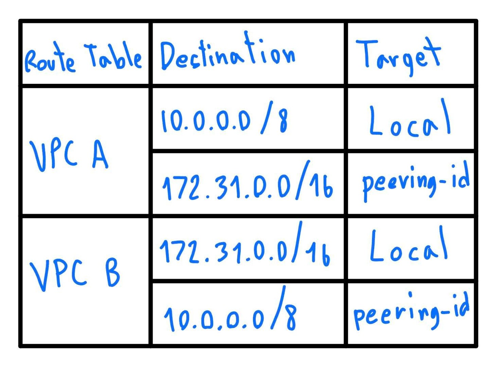
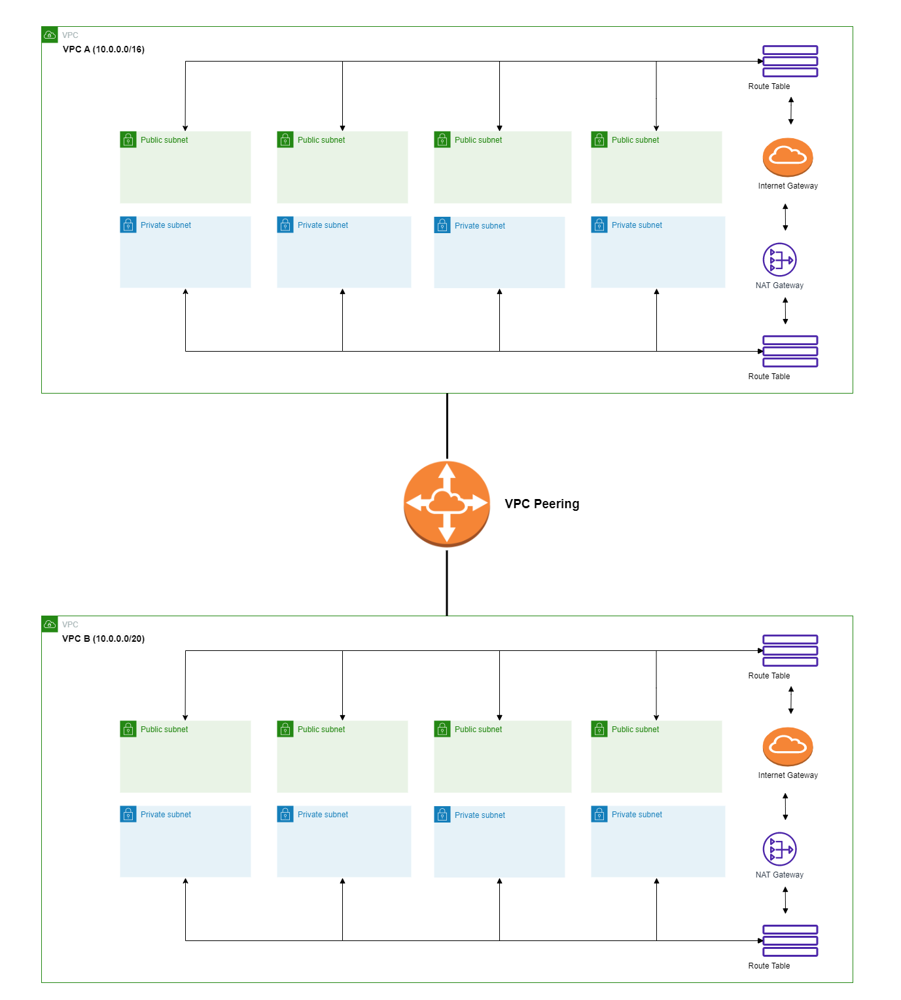
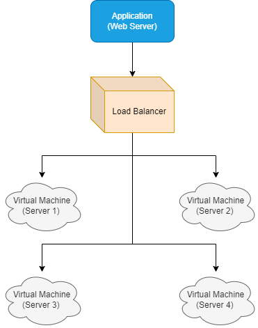

## นพกฤษฏิ์ อิสริยาเรืองกุล เลขที่ 26
### 1.กำหนดให้ VPC มี CIDR range 10.0.0.0/8 จงออกแบบ subnet(vswitch) ตามรายละเอียดดังนี้
     /8 ==> 16,777,216 IP ใช้ได้ 16,777,214
     1.1 public: 6 zone พร้อมระบุจำนวน ip ที่ใช้ได้
     -Public IP ทั้งหมด 16,777,214/2 = 8,388,607 IP นำมาแบ่ง 6 zone ใช้ Public ได้ Zone ละ 8,388,607/6 = 1,398,101 IP 
     ตีเป็น 2,097,152 IP คือ CIDR 11 
     รวม Public IP ทั้งหมด (2,097,152-2)*6 = 12,582,900 IP ที่ใช้ได้
     1.2 private: 6 zone พร้อมระบุจำนวน ip ที่ใช้ได้
     -นำ 16,777,214-12,582,900 = 4,194,314 IP นำมาแบ่ง 6 zone ใช้ private ได้ Zone ละ 4,194,314/6 = 699,052 IP ตีเป็น 524,288 คือ CIDR 13 รวม Private IP ทั้งหมด (524,288-2)*6 = 3,145,716 IP ที่ใช้ได้
     1.3 ระบุจำนวน ip ที่ยังเหลือ 
     -เหลือ 16,777,214-(12,582,900+3,145,716) = 1,048,598 IP ที่ยังเหลือ
> เงื่อนไข: ให้เหลือจำนวน Available IPs น้อยที่สุด
### 2.กำหนดให้ VPC มี CIDR range 172.31.0.0/16 จงออกแบบ subnet(vswitch) ตามรายละเอียดดังนี้
     /16 ==> 65,536 IP ใช้ได้ 65,534
     2.1 public 4 zone พร้อมระบุจำนวน ip ที่ใช้ได้
     -Public IP ทั้งหมด 65,534/2 = 32,767 IP นำมาแบ่ง 4 zone ใช้ Public ได้ Zone ละ 32,767/4 = 8,191 IP ตีเป็น 8,192 IP คือ CIDR 19
     รวม Public IP ทั้งหมด (8,192-2)*4 = 32,760 IP ที่ใช้ได้
     2.2 private: 4 zone พร้อมระบุจำนวน ip ที่ใช้ได้
     -นำ 65,534-32,760 = 32,774 IP นำมาแบ่ง 4 zone ใช้ private ได้ Zone ละ 32,774/4 = 8,193 IP ให้เป็น 4,096 คือ CIDR 20 
     รวม Private IP ทั้งหมด (4,096-2)*4 = 16,376 IP ที่ใช้ได้
     2.3 ระบุจำนวน ip ที่ยังเหลือ
     -เหลือ 65,534-(32,760+16,376) = 16,398 IP ที่ยังเหลือ
> เงื่อนไข: ให้เหลือจำนวน Available IPs มากที่สุด
### 3.จากคำตอบข้อ 1 และ 2 ให้ตอบคำถามย่อยต่อไปนี้
     3.1 ต้องใช้ Service อะไรที่ทำให้ VPC จากข้อที่ 1 และ 2 สามารถรับส่งข้อมูลถึงกันได้
     -ใช้ VPC Peering จะได้ Peering-id นำไประบุใน Route table
3.2 จงวาดตาราง Route Table พร้อมระบุการ ค่าให้เรียบร้อย
     

### 5.กำหนดให้ VPC A มี CIDR (10.0.0.0/16) และ VPC B มี CIDR (10.0.0.0/20)จงตอบคำถามต่อไปนี้
     5.1 VPC A และ VPC B สามารถ peering กันได้หรือไม่ หากไม่ได้จงบอกเหตุผล
     -Range ของ A และ B Overlaps กัน วิธีแก้คือเปลี่ยน VPC B เป็น 10.10.0.0/20 
     5.2 กรณีถ้า Peering ได้ จะต้องทำอย่างไร ให้ service ที่อยู่ภายใน VPC ทั้งสองสามารถติดต่อสื่อสารกันได้
     -ต้องระบุค่า Route table ให้ VPC Peering เพื่อให้สามารถติดต่อกันได้
#### 5.3 ให้วาดรูป architecture ประกอบ,5.4 (Optional) ใส่ component อื่นๆ ให้ครบ เช่น LB, Compute Engine, NatGW

     

### 6.Hypervisor มีกี่ประเภทแต่ละประเภทคืออะไรบ้าง แล้วประเภทไหนที่ Computer ของเราใช้งานในการเปิด emulator (อยากให้ตอบตามความเข้าใจ ห้าม copy มาตอบ)
     -Hypervisor แบ่งออกเป็น 2 ประเภทหลัก ได้แก่ Bare-Metal Hypervisor และ Hosted Hypervisor

     Bare-Metal Hypervisor เป็น Hypervisor ที่ติดตั้งตรงบนฮาร์ดแวร์ของเครื่องคอมพิวเตอร์       ซึ่งจะทำหน้าที่จัดการทรัพยากรฮาร์ดแวร์และสร้าง Virtual Machine ขึ้นมาเพื่อให้ระบบปฏิบัติการสามารถทำงานบน Virtual Machine ได้ โดยไม่ต้องไปแก้ไขระบบปฏิบัติการเดิมในเครื่องจริง

     Hosted Hypervisor เป็น Hypervisor ที่ติดตั้งบนระบบปฏิบัติการเดิมของเครื่องคอมพิวเตอร์ ซึ่งจะทำหน้าที่สร้าง Virtual Machine ขึ้นมาเพื่อให้ระบบปฏิบัติการสามารถทำงานบน Virtual Machine ได้

     เครื่องคอมพิวเตอร์ทั่วไปที่ใช้งานในการเปิด emulator มักจะใช้ Hosted Hypervisor เช่น VMware Workstation เป็นต้น

### 8.ให้ตอบคำถามต่อไปนี้เกี่ยวกับ Debian
     8.1 Debian คืออะไร
      -Debian เป็นระบบปฏิบัติการแบบเป็น Open-Source ที่มีพื้นฐานมาจาก Linux โดยมีความเป็นระบบปฏิบัติการที่มีความเสถียรและเป็นมาตรฐานสูง 
      ระบบปฏิบัติการ Debian มีความหลากหลายในการใช้งานและมีฟังก์ชั่นที่หลากหลาย สามารถใช้งานได้กับหลายแพลตฟอร์มและชุดคำสั่งที่หลากหลาย รวมถึงมีความยืดหยุ่นในการกำหนดค่าและปรับแต่งระบบได้อย่างอิสระ   
     8.2 version stable ล่าสุดมีชื่อเล่นว่าอะไร
      -Bullseye 
     8.3 Package Manager ต้องใช้คำสั่งอะไร
      -apt update
      -cat /etc/debian_version
      -cat /etc/os-release
     8.4 หากต้องการติดตั้ง git ควรใช้คำสั่งอะไร
      -apt install git

### 9.ให้ตอบคำถามต่อไปนี้เกี่ยวกับ Alpine
     9.1 Alpine คืออะไร
      -Alpine เป็นระบบปฏิบัติการแบบเป็นโอเพ่นซอร์ส (Open-Source) ที่มีความเร็วและประสิทธิภาพสูง มีขนาดเล็กและมีน้ำหนักเบา ออกแบบมาเพื่อให้ใช้ทรัพยากรของเครื่องน้อยที่สุดเท่าที่จะเป็นไปได้ ซึ่งทำให้เหมาะสำหรับการใช้งานบนเครื่องที่มีข้อจำกัดเช่น เครื่องที่มีการใช้งานทรัพยากรจำกัดหรืออุปกรณ์ที่มีขนาดเล็ก เช่น Raspberry Pi หรือเครื่องอื่น ๆ ที่มีความต้องการใช้พลังในการประมวลผลต่ำ
     9.2 version stable ล่าสุดมีคือ version อะไร
      - 3.17
     9.3 Package Manager ต้องใช้คำสั่งอะไร
      - apk update: ใช้เพื่ออัพเดตข้อมูลเกี่ยวกับแพ็กเกจในระบบ
        apk add: ใช้เพื่อติดตั้งแพ็กเกจใหม่ในระบบ
        apk upgrade: ใช้อัพเกรดแพ็กเกจที่มีอยู่ในระบบ
        apk del: ใช้เพื่อลบแพ็กเกจที่ไม่ต้องการใช้ออกจากระบบ

     9.4 หากต้องการติดตั้ง git ควรใช้คำสั่งอะไร
      - apk add git

### 10.ให้ตอบคำถามต่อไปนี้เกี่ยวกับ Amazonlinux
     10.1 Amazonlinux คืออะไร
      -Amazon Linux เป็นระบบปฏิบัติการ Linux ที่ได้รับการพัฒนาขึ้นโดย Amazon Web Services (AWS) เพื่อใช้ในการรันแอปพลิเคชันบน AWS Cloud โดยเฉพาะ
     10.2 version stable ล่าสุดมีชื่อเล่นว่าอะไร
      - Bottlerocket
     10.3 Package Manager ต้องใช้คำสั่งอะไร
      -ใน Amazon Linux, Package Manager ที่ใช้งานเป็นหลักคือ yum คำสั่งเบื้องต้นของ yum คือ "yum install [package_name]" ซึ่งจะทำการดาวน์โหลดและติดตั้งแพ็กเกจที่ระบุ
     10.4 หากต้องการติดตั้ง git ควรใช้คำสั่งอะไร
      - yum install git

### 11.หากเราต้องการสร้างบริษัทเป็นผู้ให้บริการ Cloud จงตอบคำถามต่อไปนี้
     11.1 เราควรมีอุปกรณ์ Hardware อะไรบ้าง พร้อมอธิบาย
      1.Server: ต้องมี server ที่มีความเร็วและประสิทธิภาพสูง เพื่อรองรับการใช้งานที่หนักและมีความเร่งด่วน โดย server   จะต้องรองรับการทำงานร่วมกับระบบเครือข่าย เพื่อให้สามารถเชื่อมต่อเข้าถึง Cloud ได้
      2.Storage: ต้องมีอุปกรณ์ storage ที่มีความจุสูงเพื่อเก็บข้อมูลที่จำเป็นในการให้บริการ Cloud
      3.Network equipment: ต้องมีอุปกรณ์เครือข่าย เช่น Router, Switch, Firewall เพื่อรองรับการเชื่อมต่อเข้าถึง Cloud และเพิ่มความปลอดภัยในการให้บริการ Cloud
      4.Load balancer: อุปกรณ์นี้จะช่วยในการแบ่งเบาภาระการทำงานของ server เพื่อให้การให้บริการ Cloud มีประสิทธิภาพมากยิ่งขึ้น

     11.2 เราควรมี Software อะไรบ้าง พร้อมอธิบาย
      1.Hypervisor: เป็นซอฟต์แวร์ที่ช่วยในการจำลองเซิร์ฟเวอร์ เพื่อให้ทรัพยากรของเซิร์ฟเวอร์แบ่งปันให้กับลูกค้าได้ ซึ่ง Hypervisor จะช่วยในการจัดการทรัพยากรของเซิร์ฟเวอร์
      2.Virtualization Management Software: เป็นซอฟต์แวร์ที่ช่วยในการจัดการทรัพยากรของเซิร์ฟเวอร์ โดยเฉพาะในการจัดการ virtual machine สามารถติดตั้งและกำหนดค่าให้ virtual machine และตัวเลือกการตั้งค่าอื่นๆ เช่น CPU, RAM, หรือ Network ได้อย่างง่ายดาย
      3.Cloud Management Platform: เป็นซอฟต์แวร์ที่ช่วยในการจัดการทรัพยากรใน Cloud ทั้งหมด เช่น การตั้งค่า, การจัดการ virtual machine, การจัดการเครือข่าย, และการจัดการการเข้าถึงลูกค้า 
      4.Storage Software: เป็นซอฟต์แวร์ที่ช่วยในการจัดการพื้นที่เก็บข้อมูล โดยเฉพาะในการจัดการพื้นที่เก็บข้อมูลใน Cloud

  ####   11.3 วาดภาพ Architecture ของ Cloud Service ของเรา

     11.4 ชื่อ Cloud ที่เราให้บริการมีชื่อว่าอะไร
      - Supa Hot Cloud
     11.5 Cloud ของเรามี service อะไร ที่ให้บริการผู้ใช้งานได้บ้าง
      1.User Interface: ส่วนติดต่อกับผู้ใช้งาน เป็นบริการที่ช่วยให้ผู้ใช้งานสามารถเข้าถึงและจัดการกับบริการ Cloud ได้ผ่านทางเว็บบราวเซอร์หรือแอปพลิเคชัน
      2.Compute Service: บริการที่เป็นผู้จัดการเครื่องคอมพิวเตอร์ ซึ่งสามารถรันรหัสที่ให้บริการและคำนวณข้อมูลได้
      3.Storage Service: บริการที่จัดการกับการจัดเก็บข้อมูล และให้บริการการเข้าถึงข้อมูลดังกล่าว
      4.Database Service: บริการที่จัดการกับการจัดเก็บข้อมูลแบบโครงสร้าง ให้บริการการค้นหาและดึงข้อมูลออกมาตามคำขอ

     
